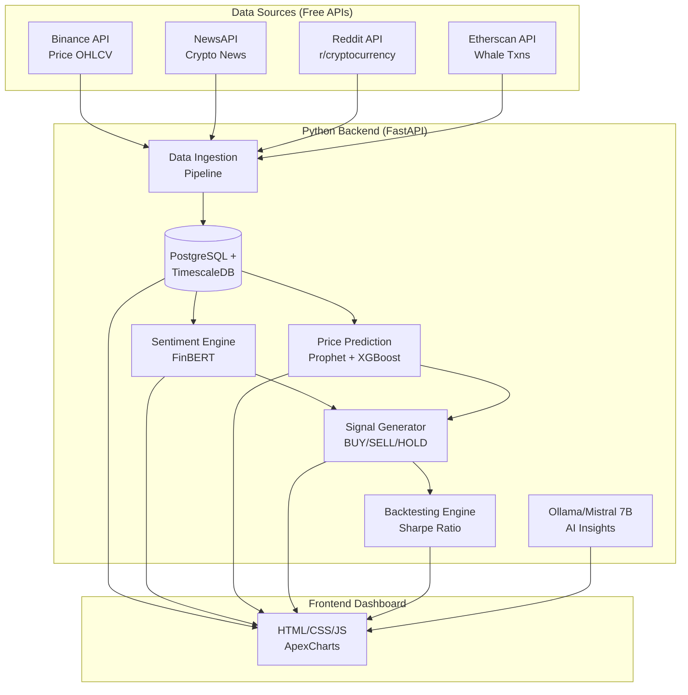

# Crypto Intelligence Terminal

Self-hosted crypto trading intelligence system using open-source LLMs to analyze sentiment, predict prices, and generate actionable trading signals.

## Model Intro

The **Crypto Intelligence Terminal** is a robust, hybrid-compute AI pipeline for cryptocurrency sentiment analysis and price prediction. It operates as a self-hosted platform running locally to maintain full data privacy and control. By leveraging both traditional quantitative modeling techniques (XGBoost, Prophet) and state-of-the-art Generative AI (Mistral-7B via QLoRA fine-tuning), the system provides an end-to-end framework for making informed, data-driven trading decisions.

## Features of this Model

- **Real-time data collection:** Pulls continuous streams of information from Reddit, News APIs, On-chain (Etherscan), and Price feeds (Binance).
- **AI-powered sentiment analysis:** Utilizes locally hosted Ollama Mistral-7B alongside FinBERT for deep contextual analysis of market news.
- **Multi-model price prediction:** Incorporates financial modeling techniques like Prophet, LSTM, and XGBoost.
- **Intelligent signal generation:** Produces definitive BUY/SELL/HOLD signals backed by explainability metrics.
- **Comprehensive backtesting engine:** Validates the historical accuracy of deployed models using the Sharpe Ratio and drawdown metrics.
- **Unified Graphical Dashboards:** Provides both full Web (Streamlit + ApexCharts) and CLI-based rich dashboards.
- **Open-source architecture:** Fully containerized for self-hosted, independent operation without reliance on expensive third-party foundational models.

## Architecture



## Requirements Needed

- **Python:** 3.9+ 
- **Containerization:** Docker and Docker Compose
- **Memory Minimum:** 16GB System RAM
- **GPU Minimum (Optional but Recommended):** 8GB GPU VRAM (NVIDIA) for heavy QLoRA model training and hardware-accelerated instance generation.

## Single Command Deployment

To set up and run the system locally, clone the repository, configure your API keys, and launch the Docker cluster. 

```bash
git clone https://github.com/Ratnachand04/FINBIN.git
cd FINBIN
cp .env.example .env

# Don't forget to edit the .env to configure your specific API keys
```

### API Keys Configuration

To fetch real-world data, the system requires API keys. You have two options to configure them:
1. **Locally via the `.env` file:** Copy `.env.example` to `.env` and insert your keys (e.g., `BINANCE_API_KEY`, `NEWS_API_KEY`). The backend services will load them securely on startup.
2. **Via the Frontend Dashboard:** Once deployed, navigate to `http://localhost:8501`. Log into the portal, navigate to the **"API Keys"** tab, and enter your credentials. The system uses these authenticated keys for live data routing behind the scenes.

### Run using Docker Compose

If you have standard docker compose installed, run:

```bash
docker-compose up -d --build
```

*(Alternatively, use the built-in deployment scripts for automatic environment checking: `./scripts/deploy_model.ps1` on Windows or `./scripts/deploy_model.sh` on Linux/macOS)*

## Teardown and Cleanup Commands

When you need to stop the models and safely remove the configuration, use the following real operational commands:

**1. Down the containers natively:**
```bash
docker-compose down
```

**2. Down the containers and remove all local generated images and database volumes (Full Reset):**
```bash
docker-compose down --rmi all -v
```

## How the Model Uses Data to Predict 

This intelligence system relies on a multi-modal approach to forecasting crypto-asset trends:

- **What it consumes:** The engine ingests time-series **price/volume data** (OHLCV metrics from Binance), **on-chain activity metrics** (massive whale transactions from Etherscan), and fundamental **market narratives** (news articles and Reddit threads). 
- **How it processes the context:** Traditional numerical indicators (like Moving Averages and RSI) are generated from the OHLCV data. Simultaneously, Mistral-7B and FinBERT read the unstructured textual feeds to compute an overarching *Bullish/Bearish Sentiment Score*.
- **What it predicts:** It projects short-to-medium-term price trajectories. The quantitative models (Prophet/XGBoost) recognize historical price patterns, while the AI models identify periods of market euphoria or panic.
- **The Final Output:** These diverse dimensions are synthesized to issue clear **BUY, SELL, or HOLD** signals alongside a "confidence" metric, explaining the narrative reasoning behind the system's choice.

## Working Process

1. **Continuous Data Ingestion:** The data ingestion pipeline operates continuously using your configured API keys, aggregating the latest daily price OHLCV data, crypto news, whale transactions, and Reddit posts into the PostgreSQL database.
2. **AI Inference & Sentiment Filtering:** The backend processes the textual and numerical data using FinBERT and an Ollama-powered Mistral-7B runtime to extract meaningful, contextual market sentiment from the raw pipeline.
3. **Price Prediction Pipeline:** Dedicated quantitative models (Prophet, XGBoost) concurrently utilize the historical time-series data to analyze and project impending price trends.
4. **Signal Aggregation:** The Signal Generator cross-references the processed sentiment data with the predictive numeric modeling to produce actionable BUY/HOLD/SELL signals. The backtesting engine then appraises these indications.
5. **Insights Presentation:** The unified frontend (developed with Streamlit and ApexCharts) surfaces these indicators within a visually coherent dashboard. 

## GPU and CPU Edition 

The architecture supports a dual-pronged **Split Runtime Deployment**, carefully balancing GPU vs. CPU resources to achieve peak operational efficiency:

- **Automatic GPU First:** By default, the environment attempts GPU deployment by leveraging CUDA extensions mapped in `docker-compose.yml` (and `docker-compose.gpu.yml` for dedicated fallback scripts).
- **GPU-CPU Workload Splitting:** Generative inferences utilizing Mistral-7B automatically allocate into the GPU-enabled `ollama` container to process tokens rapidly. Conversely, RAG (Retrieval-Augmented Generation) context retrieval and parsing isolate entirely to the CPU (`RAG_CONTEXT_CPU_ONLY=true`) in the backend. 
- **Automated CPU Fallback:** The backend performs API verification locally on initialization (`/api/v1/model/runtime`). If an incompatible CUDA runtime is identified—or if VRAM is fully constrained during deployment—the system automatically falls back and restarts the inference containers on your local CPU cores. 
- **Manual Mode Operation:** At any time, you can force purely CPU-based LoRA fine-tuning workflows via deployment flags (e.g., `-FineTuneTrainerMode cpu-lora`), dropping 4-bit quantization to ensure platform stability on machines lacking dedicated GPUs.

## Mistral Model Optimizations

To ensure the large language model (Mistral-7B) runs efficiently on consumer or mid-tier hardware, the following optimizations are natively integrated:

- **4-Bit Quantization (QLoRA):** The base Mistral model has been fully quantized to 4-bit precision using the bitsandbytes library. This dramatically decreases the required GPU VRAM for both inference and continuous fine-tuning without sacrificing context reasoning.
- **Low-Rank Adaptation (LoRA):** Rather than updating all 7-billion parameters, our local trainer scripts inject small, trainable rank decomposition matrices. This targets only the weights necessary for financial sentiment interpretation, compounding training speeds exponentially.
- **Split Workload RAG:** The heavy generative text-streaming task is strictly pinned to the GPU via Ollama, while Retrieval-Augmented Generation retrieval operations (vector embeddings, database routing) are purposely offloaded to the CPU. This cleanly preserves scarce GPU memory.

## Latest Accuracy and Backtest Scores

Performance snapshot generated on **2026-04-02** from live `price_data` in PostgreSQL.

### Runtime Notes

- GPU runtime availability for TensorFlow LSTM path: **false** (native Windows TensorFlow fallback to CPU)
- Evaluated market series available in database: **10 series total**
    - BTCUSDT: 15m, 1h, 4h, 1d
    - ETHUSDT: 15m, 1h, 4h, 1d
    - DOGEUSDT: 4h, 1d

### Aggregate Model Scores

| Model Path | Directional Accuracy | Backtested Sharpe Ratio | Signal Win Rate | Total Trades |
|-----------|----------------------|-------------------------|-----------------|--------------|
| CPU Model (`GradientBoostingRegressor`) | **52.44%** | **4.5398** | **30.23%** | 210 |
| GPU Path Model (`TensorFlow LSTM`) | **49.44%** | **-1.3907** | **1.43%** | 8 |

### Asset-Level Breakdown

| Asset | CPU Accuracy | CPU Sharpe | CPU Win Rate | CPU Trades | GPU Path Accuracy | GPU Path Sharpe | GPU Path Win Rate | GPU Path Trades |
|-------|--------------|------------|--------------|------------|-------------------|-----------------|-------------------|-----------------|
| BTC | 52.08% | 1.8146 | 29.54% | 53 | 51.26% | 0.0000 | 0.00% | 0 |
| ETH | 53.89% | 7.7973 | 33.86% | 103 | 50.28% | 0.0000 | 0.00% | 0 |
| DOGE | 50.28% | 3.4752 | 24.33% | 54 | 44.13% | -6.9534 | 7.14% | 8 |

### Interval-Level Breakdown

| Series | CPU Accuracy | CPU Sharpe | CPU Win Rate | GPU Path Accuracy | GPU Path Sharpe | GPU Path Win Rate |
|-------|--------------|------------|--------------|-------------------|-----------------|-------------------|
| BTCUSDT 15m | 54.44% | 11.0564 | 36.00% | 47.49% | 0.0000 | 0.00% |
| BTCUSDT 1h | 55.56% | 3.4250 | 23.81% | 50.84% | 0.0000 | 0.00% |
| BTCUSDT 4h | 52.78% | 9.8752 | 25.00% | 51.96% | 0.0000 | 0.00% |
| BTCUSDT 1d | 45.56% | -17.0983 | 33.33% | 54.75% | 0.0000 | 0.00% |
| DOGEUSDT 4h | 55.00% | 15.6140 | 26.09% | 48.60% | 0.7579 | 0.00% |
| DOGEUSDT 1d | 45.56% | -8.6637 | 22.58% | 39.66% | -14.6648 | 14.29% |
| ETHUSDT 15m | 52.22% | 8.8520 | 32.00% | 49.72% | 0.0000 | 0.00% |
| ETHUSDT 1h | 55.00% | 5.1060 | 35.71% | 50.28% | 0.0000 | 0.00% |
| ETHUSDT 4h | 53.89% | 23.6538 | 45.00% | 48.60% | 0.0000 | 0.00% |
| ETHUSDT 1d | 54.44% | -6.4225 | 22.73% | 52.51% | 0.0000 | 0.00% |

### How These Scores Were Computed

- **Accuracy metric:** directional accuracy = percentage of correct next-candle direction predictions.
- **Backtest Sharpe ratio:** calculated from strategy equity curve returns.
- **Signal win rate:** percentage of profitable closed trades in backtest.
- **Data source:** latest 900 rows per available symbol/interval in `price_data`.
- **Evaluation coverage:** BTC, ETH, and DOGE multi-asset price series currently present in database.
