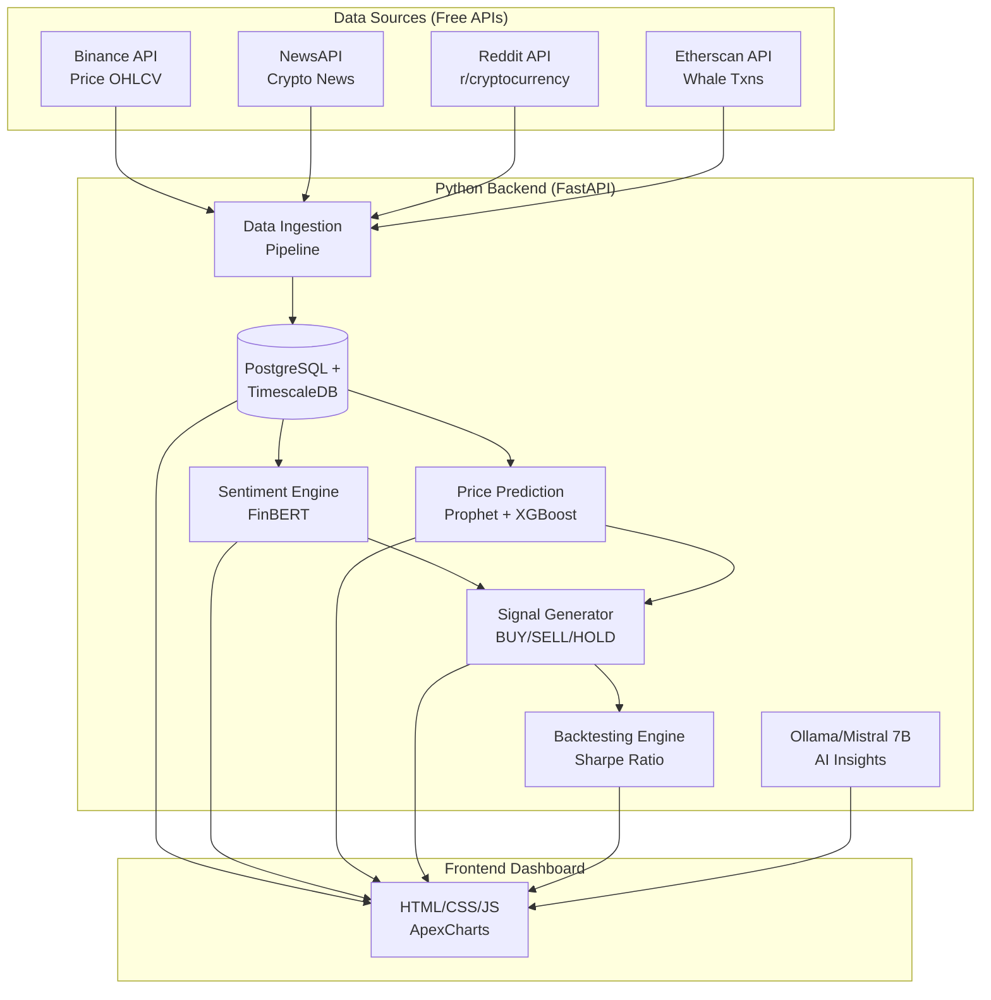

# Crypto Intelligence Terminal

Self-hosted crypto trading intelligence system using open-source LLMs to analyze sentiment, predict prices, and generate actionable trading signals.

## Model Intro

The **Crypto Intelligence Terminal** is a robust, hybrid-compute AI pipeline for cryptocurrency sentiment analysis and price prediction. It operates as a self-hosted platform running locally to maintain full data privacy and control. By leveraging both traditional quantitative modeling techniques (XGBoost, Prophet) and state-of-the-art Generative AI (Mistral-7B via QLoRA fine-tuning), the system provides an end-to-end framework for making informed, data-driven trading decisions.

## Features of this Model

- **Real-time data collection:** Pulls continuous streams of information from Reddit, News APIs, On-chain (Etherscan), and Price feeds (Binance).
- **AI-powered sentiment analysis:** Utilizes locally hosted Ollama Mistral-7B alongside FinBERT for deep contextual analysis of market news.
- **Multi-model price prediction:** Incorporates financial modeling techniques like Prophet, LSTM, and XGBoost.
- **Intelligent signal generation:** Produces definitive BUY/SELL/HOLD signals backed by explainability metrics.
- **Comprehensive backtesting engine:** Validates the historical accuracy of deployed models using the Sharpe Ratio and drawdown metrics.
- **Unified Graphical Dashboards:** Provides both full Web (Streamlit + ApexCharts) and CLI-based rich dashboards.
- **Open-source architecture:** Fully containerized for self-hosted, independent operation without reliance on expensive third-party foundational models.

## Architecture



## Requirements Needed

- **Python:** 3.9+ 
- **Containerization:** Docker and Docker Compose
- **Memory Minimum:** 16GB System RAM
- **GPU Minimum (Optional but Recommended):** 8GB GPU VRAM (NVIDIA) for heavy QLoRA model training and hardware-accelerated instance generation.

## Single Command Deployment

To set up and run the system locally, clone the repository, configure your API keys, and launch the Docker cluster. 

```bash
git clone https://github.com/Ratnachand04/FINBIN.git
cd FINBIN
cp .env.example .env

# Don't forget to edit the .env to configure your specific API keys
```

### Run using Docker Compose

If you have standard docker compose installed, run:

```bash
docker-compose up -d --build
```

*(Alternatively, use the built-in deployment scripts for automatic environment checking: `./scripts/deploy_model.ps1` on Windows or `./scripts/deploy_model.sh` on Linux/macOS)*

## Teardown and Cleanup Commands

When you need to stop the models and safely remove the configuration, use the following real operational commands:

**1. Down the containers natively:**
```bash
docker-compose down
```

**2. Down the containers and remove all local generated images and database volumes (Full Reset):**
```bash
docker-compose down --rmi all -v
```

## Working Process

1. **Continuous Data Ingestion:** The data ingestion pipeline operates continuously using your configured API keys, aggregating the latest daily price OHLCV data, crypto news, whale transactions, and Reddit posts into the PostgreSQL database.
2. **AI Inference & Sentiment Filtering:** The backend processes the textual and numerical data using FinBERT and an Ollama-powered Mistral-7B runtime to extract meaningful, contextual market sentiment from the raw pipeline.
3. **Price Prediction Pipeline:** Dedicated quantitative models (Prophet, XGBoost) concurrently utilize the historical time-series data to analyze and project impending price trends.
4. **Signal Aggregation:** The Signal Generator cross-references the processed sentiment data with the predictive numeric modeling to produce actionable BUY/HOLD/SELL signals. The backtesting engine then appraises these indications.
5. **Insights Presentation:** The unified frontend (developed with Streamlit and ApexCharts) surfaces these indicators within a visually coherent dashboard. 

## GPU and CPU Edition 

The architecture supports a dual-pronged **Split Runtime Deployment**, carefully balancing GPU vs. CPU resources to achieve peak operational efficiency:

- **Automatic GPU First:** By default, the environment attempts GPU deployment by leveraging CUDA extensions mapped in `docker-compose.yml` (and `docker-compose.gpu.yml` for dedicated fallback scripts).
- **GPU-CPU Workload Splitting:** Generative inferences utilizing Mistral-7B automatically allocate into the GPU-enabled `ollama` container to process tokens rapidly. Conversely, RAG (Retrieval-Augmented Generation) context retrieval and parsing isolate entirely to the CPU (`RAG_CONTEXT_CPU_ONLY=true`) in the backend. 
- **Automated CPU Fallback:** The backend performs API verification locally on initialization (`/api/v1/model/runtime`). If an incompatible CUDA runtime is identified—or if VRAM is fully constrained during deployment—the system automatically falls back and restarts the inference containers on your local CPU cores. 
- **Manual Mode Operation:** At any time, you can force purely CPU-based LoRA fine-tuning workflows via deployment flags (e.g., `-FineTuneTrainerMode cpu-lora`), dropping 4-bit quantization to ensure platform stability on machines lacking dedicated GPUs.
