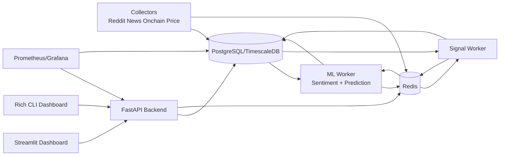

# Crypto Intelligence Terminal

Self-hosted crypto trading intelligence system using open-source LLMs to analyze sentiment, predict prices, and generate actionable trading signals.

## Features

- Real-time data collection (Reddit, News, On-chain, Prices)
- AI-powered sentiment analysis (Ollama Mistral-7B + FinBERT)
- Multi-model price prediction (Prophet + LSTM + XGBoost)
- Intelligent signal generation with explainability
- Comprehensive backtesting engine
- CLI and Web dashboards
- Open-source architecture for self-hosted operation

## Architecture



## Technology Stack

- Backend: Python 3.9+, FastAPI, SQLAlchemy
- Database: PostgreSQL + TimescaleDB
- Cache: Redis
- ML/AI: Ollama (Mistral-7B), FinBERT, Prophet, LSTM, XGBoost
- Frontend: Streamlit, Rich (CLI)
- Monitoring: Prometheus, Grafana
- Deployment: Docker Compose

## Prerequisites

- Python 3.9+
- Docker and Docker Compose
- 16GB RAM minimum
- 8GB GPU VRAM recommended for heavy model training

## Quick Start

### 1. Clone Repository

```bash
git clone https://github.com/yourusername/crypto-intelligence-terminal.git
cd crypto-intelligence-terminal
```

### 2. Setup Environment

```bash
cp .env.example .env
# edit .env and add your API keys
```

### 3. Launch Full Production Stack (Single Command)

Windows (PowerShell):

```powershell
./scripts/deploy_model.ps1
```

Linux/macOS:

```bash
./scripts/deploy_model.sh
```

What this single command deploys:
- Backend API container (FastAPI)
- Frontend container (Streamlit, login-gated)
- PostgreSQL (Timescale)
- Redis
- Ollama (self-hosted LLM runtime)

GPU/CPU behavior:
- First tries GPU deployment (`docker-compose.gpu.yml`).
- Verifies runtime device via `/api/v1/model/runtime`.
- If CUDA is unavailable/incompatible, automatically restarts in CPU mode.

## Single-Command Full Deployment (Recommended)

Use one command to deploy frontend, backend, infra, and local LLM services.
The deployment scripts now include runtime compatibility checks and CPU fallback.

PowerShell (Windows):

```powershell
./scripts/deploy_model.ps1
```

Bash (Linux/macOS):

```bash
./scripts/deploy_model.sh
```

Trigger deployment plus training in one command:

PowerShell:

```powershell
./scripts/deploy_model.ps1 -Train
```

Bash:

```bash
./scripts/deploy_model.sh --train
```

Trigger deployment plus true QLoRA fine-tuning and Ollama model packaging:

PowerShell:

```powershell
./scripts/deploy_model.ps1 -FineTune
```

Bash:

```bash
./scripts/deploy_model.sh --fine-tune
```

Run CPU LoRA fine-tuning (no 4-bit quantization) while keeping deployed inference on Ollama:

PowerShell:

```powershell
./scripts/deploy_model.ps1 -FineTune -FineTuneTrainerMode cpu-lora
```

Bash:

```bash
./scripts/deploy_model.sh --fine-tune --fine-tune-trainer-mode cpu-lora
```

Training endpoint used by the script:

```text
POST /api/v1/model/train-finance-news
```

Notes:
- API keys in `.env` are required for ingestion workers to continuously pull external data.
- The training API uses the data already collected in PostgreSQL (`price_data` and `news_articles`).
- Default Ollama model is `mistral:7b-instruct-q4_K_M`.
- If `models/active/Modelfile` exists, deployment creates that as the active Ollama model instead of only pulling a base model.

## Login + User API Keys Flow

1. Open frontend: `http://localhost:8501`
2. Register/login from the frontend portal.
3. Save provider API keys in the "API Keys" tab.
4. Backend uses authenticated user keys to drive live data retrieval for that user workflow.

This keeps model usage behind authenticated frontend access.

## True Mistral Fine-Tuning (QLoRA/LoRA)

This stack includes a dedicated trainer service (`llm-trainer`) for real adapter fine-tuning on Mistral.

### Shell Script Method (Direct)

Windows:

```powershell
./scripts/run_llm_finetune.ps1
```

Linux/macOS:

```bash
./scripts/run_llm_finetune.sh
```

### API Method (Recommended - Dashboard/Backend Integration)

Start a fine-tuning job via REST API and monitor from dashboard:

```bash
# Trigger job
curl -X POST http://localhost:8000/api/v1/llm/finetune \
  -H "Content-Type: application/json" \
  -d '{
    "adapter_name": "my-custom-v1",
    "ollama_model_name": "my-finance-bot",
		"trainer_mode": "gpu-qlora",
    "dataset_limit": 5000,
    "epochs": 1
  }' | jq .job_id

# Monitor status
curl http://localhost:8000/api/v1/llm/finetune/{job_id}
```

**Requirements for API method:**
- Celery worker is running (included in `docker-compose.yml`)
- Redis is running on port 6379
- Backend API is running on port 8000

**API Endpoints:**
- `POST /api/v1/llm/finetune` - Start job
- `GET /api/v1/llm/finetune/{job_id}` - Get status
- `GET /api/v1/llm/finetune` - List all jobs
- `GET /api/v1/llm/finetune/{job_id}/cancel` - Cancel job

`trainer_mode` values:
- `gpu-qlora`: 4-bit QLoRA using bitsandbytes on NVIDIA GPU.
- `cpu-lora`: standard LoRA on CPU (no bitsandbytes/4-bit quantization).

**Full documentation:** [docs/LLM_FINETUNE_API_GUIDE.md](docs/LLM_FINETUNE_API_GUIDE.md)

### Training Pipeline

Both methods execute the same pipeline:

1. Export supervised dataset from `news_articles`.
2. Run QLoRA fine-tuning (PEFT/TRL) on `mistralai/Mistral-7B-Instruct-v0.3`.
3. Package adapter into an Ollama `Modelfile`.
4. Build final local model in Ollama via `ollama create`.

Resulting local model name (default):

```text
binfin-mistral-finance
```

## Split Runtime Deployment (GPU Mistral + CPU RAG Context)

Default compose behavior now separates workloads:
- Ollama generation runs in the GPU-enabled `ollama` service.
- RAG context retrieval/parsing runs in `backend` with CPU-only context mode.

Relevant environment variables:
- `RAG_CONTEXT_CPU_ONLY=true`
- `RAG_CONTEXT_DEVICE=cpu`
- `RAG_OLLAMA_URL=http://ollama:11434`
- `RAG_OLLAMA_MODEL=binfin-custom`

## Replace Active Production Model

You can replace the deployed model after training without rebuilding the whole stack.

1. Update `models/active/Modelfile` to point to your trained artifact/base model.
2. Rebuild active Ollama model:

Windows:

```powershell
./scripts/replace_active_model.ps1 -ModelName binfin-mistral-finance
```

Linux/macOS:

```bash
./scripts/replace_active_model.sh binfin-mistral-finance
```

3. Set `.env` value `OLLAMA_MODEL=binfin-mistral-finance` and restart backend if needed.

This makes the final model replaceable after each training cycle.

## Training and Optimization Flow (Recommended)

1. Ingest live data continuously using configured API keys.
2. Trigger baseline finance-news training (`/api/v1/model/train-finance-news`) for fast iteration.
3. Run QLoRA fine-tuning (`/api/v1/llm/finetune` or `scripts/run_llm_finetune.*`) for model improvement.
4. Compare runtime/device/quality from frontend Model tab and API metrics.
5. Replace active model using `scripts/replace_active_model.*`.
6. Repeat with tighter datasets, better labeling quality, and tuned epochs/LR/batch settings.

## Access Points

- API: http://localhost:8000
- API Docs: http://localhost:8000/docs
- Web Dashboard: http://localhost:8501
- Prometheus: http://localhost:9090
- Grafana: http://localhost:3000

## Running Dashboards

- Web: `streamlit run frontend/app.py`
- CLI: `python -m cli.main terminal`

Alternative top-level modules:

- Web: `streamlit run dashboard/app.py`
- Terminal: `python -m terminal.cli status`
- API: `uvicorn api.main:app --reload`
- Ingestion: `python -m data_ingestion.main`
- Sentiment Worker: `python -m processing.sentiment.main`
- Signal Worker: `python -m signals.main`

## Testing

```bash
pytest tests -v
```

Additional quick checks:

```bash
pytest tests/test_sentiment.py tests/test_prediction.py tests/test_backtest.py -v
python scripts/train_models.py
```

Coverage is enabled via `pytest.ini` with component markers:

- `@pytest.mark.integration`
- `@pytest.mark.slow`

## Project Highlights

- Async workers for ingestion, ML processing, and signal generation
- Notification system with desktop/telegram/email channels
- Structured JSON logging with sensitive data masking
- API-first architecture with reusable analytics endpoints

## Notes

- Configure all credentials in `.env` before running production workflows.
- Optional dependencies gracefully degrade where supported.
