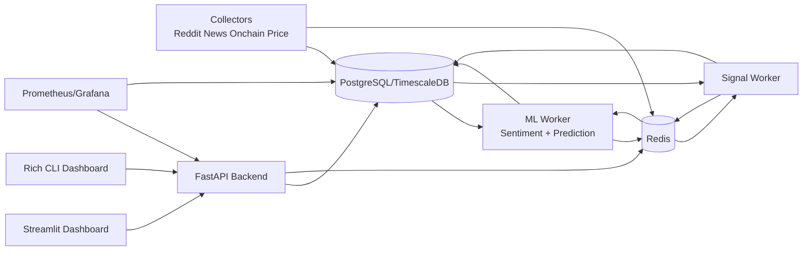

# Crypto Intelligence Terminal

Self-hosted crypto trading intelligence system using open-source LLMs to analyze sentiment, predict prices, and generate actionable trading signals.

## Features

- Real-time data collection (Reddit, News, On-chain, Prices)
- AI-powered sentiment analysis (Ollama Mistral-7B + FinBERT)
- Multi-model price prediction (Prophet + LSTM + XGBoost)
- Intelligent signal generation with explainability
- Comprehensive backtesting engine
- CLI and Web dashboards
- Open-source architecture for self-hosted operation

## Architecture



## Technology Stack

- Backend: Python 3.9+, FastAPI, SQLAlchemy
- Database: PostgreSQL + TimescaleDB
- Cache: Redis
- ML/AI: Ollama (Mistral-7B), FinBERT, Prophet, LSTM, XGBoost
- Frontend: Streamlit, Rich (CLI)
- Monitoring: Prometheus, Grafana
- Deployment: Docker Compose

## Prerequisites

- Python 3.9+
- Docker and Docker Compose
- 16GB RAM minimum
- 8GB GPU VRAM recommended for heavy model training

## Quick Start

### 1. Clone Repository

```bash
git clone https://github.com/yourusername/crypto-intelligence-terminal.git
cd crypto-intelligence-terminal
```

### 2. Setup Environment

```bash
cp .env.example .env
# edit .env and add your API keys
```

### 3. Run Setup Script

```bash
bash scripts/setup.sh
```

### 4. Launch Services

```bash
docker compose up -d
```

## Access Points

- API: http://localhost:8000
- API Docs: http://localhost:8000/docs
- Web Dashboard: http://localhost:8501
- Prometheus: http://localhost:9090
- Grafana: http://localhost:3000

## Running Dashboards

- Web: `streamlit run frontend/app.py`
- CLI: `python -m cli.main terminal`

## Testing

```bash
pytest tests -v
```

Coverage is enabled via `pytest.ini` with component markers:

- `@pytest.mark.integration`
- `@pytest.mark.slow`

## Project Highlights

- Async workers for ingestion, ML processing, and signal generation
- Notification system with desktop/telegram/email channels
- Structured JSON logging with sensitive data masking
- API-first architecture with reusable analytics endpoints

## Notes

- Configure all credentials in `.env` before running production workflows.
- Optional dependencies gracefully degrade where supported.
