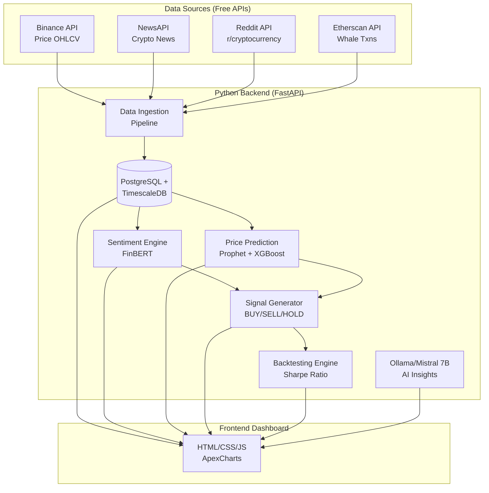

# Crypto Intelligence Terminal

Self-hosted crypto trading intelligence system using open-source LLMs to analyze sentiment, predict prices, and generate actionable trading signals.

> **Measured results:** [Performance Evaluation](#performance-evaluation) &nbsp;|&nbsp;
> **Reproduce:** `python scripts/evaluate_walkforward.py` &nbsp;|&nbsp;
> **Verify the backtester:** `python scripts/null_test_backtest.py` &nbsp;|&nbsp;
> **Paper:** [`paper/crypto_direction_evaluation.tex`](paper/crypto_direction_evaluation.tex)

## Model Intro

The **Crypto Intelligence Terminal** is a robust, hybrid-compute AI pipeline for cryptocurrency sentiment analysis and price prediction. It operates as a self-hosted platform running locally to maintain full data privacy and control. By leveraging both traditional quantitative modeling techniques (XGBoost, Prophet) and state-of-the-art Generative AI (Mistral-7B via QLoRA fine-tuning), the system provides an end-to-end framework for making informed, data-driven trading decisions.

## Features of this Model

- **Real-time data collection:** Pulls continuous streams of information from Reddit, News APIs, On-chain (Etherscan), and Price feeds (Binance).
- **AI-powered sentiment analysis:** Utilizes locally hosted Ollama Mistral-7B alongside FinBERT for deep contextual analysis of market news.
- **Multi-model price prediction:** Incorporates financial modeling techniques like Prophet, LSTM, and XGBoost.
- **Intelligent signal generation:** Produces definitive BUY/SELL/HOLD signals backed by explainability metrics.
- **Comprehensive backtesting engine:** Validates the historical accuracy of deployed models using the Sharpe Ratio and drawdown metrics.
- **Unified Graphical Dashboards:** Provides a full animated Web dashboard (HTML/CSS/JS + Lightweight Charts) and CLI-based rich dashboards.
- **Open-source architecture:** Fully containerized for self-hosted, independent operation without reliance on expensive third-party foundational models.

## Architecture


```mermaid
flowchart TD
    subgraph DataSources["Data Sources (Free APIs)"]
        direction LR
        A["Binance API\nPrice OHLCV"] 
        B["NewsAPI\nCrypto News"]
        C["Reddit API\nr/cryptocurrency"]
        D["Etherscan API\nWhale Txns"]
    end

    subgraph Backend["Python Backend (FastAPI)"]
        E["Data Ingestion\nPipeline"]
        F[("PostgreSQL +\nTimescaleDB")]
        G["Sentiment Engine\nFinBERT"]
        H["Price Prediction\nProphet + XGBoost"]
        I["Signal Generator\nBUY/SELL/HOLD"]
        J["Backtesting Engine\nSharpe Ratio"]
        K["Ollama/Mistral 7B\nAI Insights"]

        E --> F
        F --> G
        F --> H
        G --> I
        H --> I
        I --> J
    end

    subgraph Frontend["Frontend Dashboard"]
        L["HTML/CSS/JS\nApexCharts"]
    end

    A --> E
    B --> E
    C --> E
    D --> E

    F --> L
    G --> L
    H --> L
    I --> L
    J --> L
    K --> L
```

## Requirements Needed

- **Python:** 3.9+ 
- **Containerization:** Docker and Docker Compose
- **Memory Minimum:** 16GB System RAM
- **GPU Minimum (Optional but Recommended):** 8GB GPU VRAM (NVIDIA) for heavy QLoRA model training and hardware-accelerated instance generation.

## Single Command Deployment

To set up and run the system locally, clone the repository, configure your API keys, and launch the Docker cluster. 

```bash
git clone https://github.com/Ratnachand04/FINBIN.git
cd FINBIN
cp .env.example .env

# Don't forget to edit the .env to configure your specific API keys
```

### API Keys Configuration

To fetch real-world data, the system requires API keys. You have two options to configure them:
1. **Locally via the `.env` file:** Copy `.env.example` to `.env` and insert your keys (e.g., `BINANCE_API_KEY`, `NEWS_API_KEY`). The backend services will load them securely on startup.
2. **Via the Frontend Dashboard:** Once deployed, navigate to `http://localhost:8501`. The dashboard opens directly (no username/password prompt) and streams live backend data.

### Run using Docker Compose

If you have standard docker compose installed, run:

```bash
docker-compose up -d --build
```

*(Alternatively, use the built-in deployment scripts for automatic environment checking: `./scripts/deploy_model.ps1` on Windows or `./scripts/deploy_model.sh` on Linux/macOS)*

## Teardown and Cleanup Commands

When you need to stop the models and safely remove the configuration, use the following real operational commands:

**1. Down the containers natively:**
```bash
docker-compose down
```

**2. Down the containers and remove all local generated images and database volumes (Full Reset):**
```bash
docker-compose down --rmi all -v
```

## How the Model Uses Data to Predict 

This intelligence system relies on a multi-modal approach to forecasting crypto-asset trends:

- **What it consumes:** The engine ingests time-series **price/volume data** (OHLCV metrics from Binance), **on-chain activity metrics** (massive whale transactions from Etherscan), and fundamental **market narratives** (news articles and Reddit threads). 
- **How it processes the context:** Traditional numerical indicators (like Moving Averages and RSI) are generated from the OHLCV data. Simultaneously, Mistral-7B and FinBERT read the unstructured textual feeds to compute an overarching *Bullish/Bearish Sentiment Score*.
- **What it predicts:** It projects short-to-medium-term price trajectories. The quantitative models (Prophet/XGBoost) recognize historical price patterns, while the AI models identify periods of market euphoria or panic.
- **The Final Output:** These diverse dimensions are synthesized to issue clear **BUY, SELL, or HOLD** signals alongside a "confidence" metric, explaining the narrative reasoning behind the system's choice.

## Working Process

1. **Continuous Data Ingestion:** The data ingestion pipeline operates continuously using your configured API keys, aggregating the latest daily price OHLCV data, crypto news, whale transactions, and Reddit posts into the PostgreSQL database.
2. **AI Inference & Sentiment Filtering:** The backend processes the textual and numerical data using FinBERT and an Ollama-powered Mistral-7B runtime to extract meaningful, contextual market sentiment from the raw pipeline.
3. **Price Prediction Pipeline:** Dedicated quantitative models (Prophet, XGBoost) concurrently utilize the historical time-series data to analyze and project impending price trends.
4. **Signal Aggregation:** The Signal Generator cross-references the processed sentiment data with the predictive numeric modeling to produce actionable BUY/HOLD/SELL signals. The backtesting engine then appraises these indications.
5. **Insights Presentation:** The unified frontend (developed with HTML/CSS/JS and Lightweight Charts) surfaces these indicators in a live animated dashboard.

## GPU and CPU Edition 

The architecture supports a dual-pronged **Split Runtime Deployment**, carefully balancing GPU vs. CPU resources to achieve peak operational efficiency:

- **Automatic GPU First:** By default, the environment attempts GPU deployment by leveraging CUDA extensions mapped in `docker-compose.yml` (and `docker-compose.gpu.yml` for dedicated fallback scripts).
- **GPU-CPU Workload Splitting:** Generative inferences utilizing Mistral-7B automatically allocate into the GPU-enabled `ollama` container to process tokens rapidly. Conversely, RAG (Retrieval-Augmented Generation) context retrieval and parsing isolate entirely to the CPU (`RAG_CONTEXT_CPU_ONLY=true`) in the backend. 
- **Automated CPU Fallback:** The backend performs API verification locally on initialization (`/api/v1/model/runtime`). If an incompatible CUDA runtime is identified—or if VRAM is fully constrained during deployment—the system automatically falls back and restarts the inference containers on your local CPU cores. 
- **Manual Mode Operation:** At any time, you can force purely CPU-based LoRA fine-tuning workflows via deployment flags (e.g., `-FineTuneTrainerMode cpu-lora`), dropping 4-bit quantization to ensure platform stability on machines lacking dedicated GPUs.

## Mistral Model Optimizations

To ensure the large language model (Mistral-7B) runs efficiently on consumer or mid-tier hardware, the following optimizations are natively integrated:

- **4-Bit Quantization (QLoRA):** The base Mistral model has been fully quantized to 4-bit precision using the bitsandbytes library. This dramatically decreases the required GPU VRAM for both inference and continuous fine-tuning without sacrificing context reasoning.
- **Low-Rank Adaptation (LoRA):** Rather than updating all 7-billion parameters, our local trainer scripts inject small, trainable rank decomposition matrices. This targets only the weights necessary for financial sentiment interpretation, compounding training speeds exponentially.
- **Split Workload RAG:** The heavy generative text-streaming task is strictly pinned to the GPU via Ollama, while Retrieval-Augmented Generation retrieval operations (vector embeddings, database routing) are purposely offloaded to the CPU. This cleanly preserves scarce GPU memory.

## Performance Evaluation

Reproduce with `python scripts/evaluate_walkforward.py`. Full output in
[`docs/evaluation_results.json`](docs/evaluation_results.json).

**Headline: a zero-parameter rule matches the model, and neither is tradable.**
The machine-learning model predicts next-day direction at 52.95% over 5,562
out-of-sample predictions (p < 1e-4 vs a coin flip). *Inverse persistence* --
bet against yesterday's sign, no parameters, no features -- scores 52.88% on the
same days. Paired tests give differences of -0.29 / +0.53 / -0.07 percentage
points on BTC / ETH / DOGE, none significant, with the model behind on two of
three. Thirty-four engineered features recover a documented one-day reversal
effect and add nothing measurable to it.

### Setup

| | |
|---|---|
| Instrument | Binance **spot**, USDT quoted |
| Data | BTC/ETH from 2017-08-17, DOGE from its 2019 listing, through 2026-04-01 |
| Out-of-sample | 5,562 predictions, 2020-07-17 to 2026-03-30 (BTC/ETH 2,083 each; DOGE 1,396 from 2022-06-04) |
| Validation | Expanding-window walk-forward, 1,000-day initial train, 250-day folds, **5-day embargo**; 9 folds BTC/ETH, 6 DOGE |
| Features | 34 causal single-asset features (returns, vol, bar shape, Binance order-flow fields, RSI/MACD/BB/ATR) |
| Preprocessing | `StandardScaler` fitted **inside each fold on training rows only** |
| Costs | 4 bps taker + 5 bps slippage, per side |

### Directional accuracy (out-of-sample)

| Asset | Predictor | n | Accuracy | 95% CI (Wilson) | p vs .5 | PT p |
|---|---|---:|---:|---|---:|---:|
| BTC | Logistic | 2,083 | 52.71% | [50.6, 54.8] | 0.013 | 0.015 |
| BTC | **Inverse persistence** | 2,083 | **53.00%** | [50.9, 55.1] | 0.006 | — |
| ETH | Logistic | 2,083 | 53.10% | [50.9, 55.2] | 0.005 | 0.008 |
| ETH | Inverse persistence | 2,083 | 52.57% | [50.4, 54.7] | 0.019 | — |
| DOGE | Logistic | 1,396 | 53.08% | [50.5, 55.7] | 0.021 | 0.016 |
| DOGE | **Inverse persistence** | 1,396 | **53.15%** | [50.5, 55.7] | 0.019 | — |
| **Pooled** | **Logistic** | **5,562** | **52.95%** | [51.6, 54.3] | <1e-4 | — |
| **Pooled** | **Inverse persistence** | **5,562** | **52.88%** | [51.6, 54.2] | <1e-4 | — |
| Pooled | Majority class | 5,562 | 50.49% | [49.2, 51.8] | 0.469 | — |

Paired (model minus inverse persistence, same days): BTC -0.29pp (t=-0.24),
ETH +0.53pp (t=+0.45), DOGE -0.07pp (t=-0.05). None significant.

The model is also **worse on the days that matter**: return-weighted hit rate is
51.68 / 51.57 / 52.33% versus unweighted accuracy of 52.71 / 53.10 / 53.08%.
Information coefficient is +0.016 / +0.017 / +0.030.

Per-fold accuracy ranges from 0.422 to 0.616, and the most recent fold is below
chance on all three assets. The pooled number averages a very unstable series.

### Book statistics and cost sensitivity

| Weighting | mu (%/yr) | sigma (%/yr) | SR gross | SR net | Turnover |
|---|---:|---:|---:|---:|---:|
| Equal | +6.61 | 58.38 | +0.544 | +0.113 | 0.765 |
| Inverse-vol | +4.25 | 55.14 | +0.527 | +0.077 | 0.755 |

| Cost per side (bps) | 0 | 3 | 5 | 7 | **9** | 12 | 15 | 20 |
|---|---:|---:|---:|---:|---:|---:|---:|---:|
| Annualised Sharpe | 0.544 | 0.400 | 0.305 | 0.209 | **0.113** | -0.030 | -0.174 | -0.413 |

Turnover 0.765/day = **6.89 bps/day** at 9 bps/side. Breakeven is **11.4 bps per
side, 95% CI [0.0, 26.9]** -- the interval contains the assumed cost, so
tradability is not established either way. Gross Sharpe 0.544 has a
stationary-bootstrap 95% CI of **[-0.17, +1.28], which contains zero**.

Confidence gating makes it worse, monotonically: net Sharpe falls from +0.113
(no gate) to -0.309 at |p-0.5| >= 0.08. The model's confidence is
anti-informative.

### What actually consumes the edge

| Step | Configuration | Sharpe | Delta |
|---|---|---:|---:|
| 1 | Label window C_t -> C_t+1, no cost | +0.544 | — |
| 2 | + transaction costs (9 bps/side) | +0.113 | **-0.431** |
| 3 | + 1-bar entry lag, 1-day hold | +0.114 | +0.001 |
| 4 | + 2-day hold (holding-period fault) | -0.030 | -0.144 |

**The entry lag is free.** Crypto trades 24/7, so there is no overnight gap:
close-to-open dispersion is 5.8 / 7.5 / 16.5 bps against intraday dispersion of
357 / 459 / 1014 bps -- a ratio of 1.6% on all three assets. Costs dominate.

### End-to-end backtest

| Holding rule | Trades | Win rate | Net/trade | Gross/trade | Sharpe |
|---|---:|---:|---:|---:|---:|
| 1-bar (corrected) | 5,562 | 49.30% | -0.081% | +0.099% | -0.467 |
| 2-bar (previous) | 5,562 | 50.02% | -0.094% | +0.086% | -0.344 |

Mean trade is **gross profitable**; the 18 bps round trip is what makes it lose.

Against passive exposure: correlation +0.224, beta +0.215, passive basket Sharpe
+0.833, and **appraisal ratio -0.076** -- the correct statistic for whether an
uncorrelated sleeve adds anything. It does not.

### Verification

- **Mutation score 8/8** (`python scripts/mutation_matrix.py`): every
  reintroducible fault is caught by the suite. Output in
  [`docs/mutation_matrix.json`](docs/mutation_matrix.json).
- **Randomised null test** (`python scripts/null_test_backtest.py`): 60 seeds,
  mean Sharpe -3.53 (t = -7.51), cash conserved to 1.2e-11. Note that **13.3% of
  correct-engine seeds produce a positive Sharpe**, so a single-path assertion
  would flake roughly one run in eight -- which is why it runs over a
  distribution.

### Honest conclusions

1. Daily crypto returns show one-day reversal, detectable at p < 1e-4.
2. A one-line rule captures it. The ML pipeline adds nothing measurable.
3. It is not tradable on this feature set: gross Sharpe CI contains zero and the
   appraisal ratio against passive exposure is negative.
4. Costs, not timing, are the binding constraint.
5. This is a single-asset technical feature set. Funding rates, open interest,
   basis, liquidations, order-book imbalance and cross-asset lead-lag are all
   absent, so this is not a negative result about crypto forecasting generally.


### Excluded: the simulated sentiment feature

`data_ingestion/output/sentiment/*.csv` is **not** used in this evaluation.
Those files are generated by
[`data_ingestion/scripts/fetch_sentiment_data.py`](data_ingestion/scripts/fetch_sentiment_data.py)
as `clip(same_day_return * 15, -1, 1) + uniform(-0.2, 0.2)`, with a headline
drawn from 15 fixed templates. Measured against BTC daily bars:

| Relationship | Correlation | Sign agreement |
|---|---:|---:|
| `sentiment_score` vs **same-day** return | **0.916** | 87.0% |
| `sentiment_score` vs **next-day** return | -0.018 | 47.2% |

It is a re-encoding of the same day's label with noise, carrying no forward
information. Including it as a predictor of same-day direction would produce a
large and entirely spurious accuracy. Any sentiment claim requires real
timestamped text, which this dataset does not contain.

### What an earlier revision got wrong

A previous version of this README published Sharpe ratios above 20. Those came
from the defects below, all of which inflated or corrupted reported performance.
Each is now pinned by a regression test in
[`tests/test_backtest_engine_correctness.py`](tests/test_backtest_engine_correctness.py)
and [`tests/test_feature_pipeline_correctness.py`](tests/test_feature_pipeline_correctness.py).

| Defect | Effect on reported numbers |
|---|---|
| Open positions were priced from the *incoming signal's* symbol, not their own | In multi-asset runs, a BTC position could be stopped out at DOGE's price |
| Price lookup selected the nearest bar by absolute time distance | Fills could resolve against a bar that had not occurred yet (look-ahead) |
| Sharpe annualised per-trade returns by `sqrt(252)` | Trades do not arrive on a fixed clock; the factor was arbitrary. Source of the >20 Sharpe values |
| Short positions marked to market as `+price x qty` | A short *gained* equity as the price rose, corrupting the equity curve and every metric derived from it |
| Stops and targets evaluated only when a new signal arrived, and only against `close` | Intrabar stop hits were never simulated |
| Monte Carlo shuffled the P&L list and summed it | Summation is permutation-invariant, so all simulated paths were identical, the confidence interval collapsed to a point, and P(profit) was always 0 or 1 |
| Calmar divided return by the single worst *trade* | Calmar is defined against peak-to-trough drawdown of the equity curve |
| Trainer reported `sharpe_ratio` and `profit_factor` built from +/-1 per correct prediction | Both are deterministic transforms of accuracy (`mean = 2*acc - 1`, `PF = acc/(1-acc)`), not risk or P&L measures |
| `900 rows per symbol/interval` applied uniformly across timeframes | 900 15m bars is 9.4 days of data — too short to support any claim |
| `StandardScaler().fit_transform()` called on a single row at inference | One sample per column has zero variance, so every served feature vector was identically 0.0 |
| Train/validation split had no embargo, with 60-step windows and 672-bar rolling features | Adjacent folds shared underlying bars; validation partly measured training data |
| Missing values imputed with the mean of the full frame | Future rows leaked into past ones through the imputation statistic |

### Methodology

- **Fills.** A signal computed from the close of bar *i* is executed at the open
  of bar *i+1*. No fill can reference a bar at or after its own execution bar.
- **Exits.** Stop and target are checked against each bar's high/low. When one
  bar touches both levels, the stop is assumed to have filled first, since OHLC
  data cannot resolve the ordering.
- **Costs.** 4bp per side (Binance spot taker) plus 5bp slippage per side,
  charged on both legs.
- **Sharpe.** Computed from equity-curve returns sampled at the bar cadence, with
  the annualisation factor inferred from the observed bar spacing
  (15m bars annualise by `sqrt(35040)`, daily bars by `sqrt(365)`).
- **Accuracy.** Reported with a 95% confidence interval, a binomial p-value
  against the 50% null, and the majority-class baseline. A hit rate without
  those three numbers is not a result.
- **Baselines.** Every strategy figure is reported alongside buy-and-hold and a
  persistence (last-value) forecast over the identical window.
- **Validation.** Walk-forward with a purge and embargo of at least the longest
  feature lookback window between train and test folds.

### Corrections made in the current revision

An earlier revision of this README reported 52.94% accuracy as the finding and
concluded the signal was "statistically real but economically marginal". That
conclusion did not survive review. The following were corrected:

| Error | Correction |
|---|---|
| **Inverse persistence was never reported** | It scores 52.88% pooled, matching the model. This inverts the headline. |
| Engine held 2 bars against a 1-bar label | Added explicit `hold_bars`; the fault cost 0.144 Sharpe |
| Gap attributed to "forfeited overnight gap" | Crypto is 24/7; the lag costs +0.001. Costs consume 0.431. |
| Daily cost stated as 14 bps | 0.765 turnover x 9 bps = **6.89 bps/day** |
| Breakeven quoted as 10.74 bps | 11.4 bps with 95% CI **[0.0, 26.9]** |
| Cost curve truncated to shortest series | Date-aligned panel; 2,083 days instead of 1,397 |
| Single-path null test proposed as a standard | 13.3% of correct-engine seeds give positive Sharpe; now runs 60 seeds |
| Buy-and-hold compared on raw Sharpe | Appraisal ratio (-0.076) is the correct statistic |
| Wald intervals, test only vs 0.5 | Wilson intervals, paired tests, Pesaran-Timmermann |
| No uncertainty on any Sharpe | Stationary-bootstrap CI: gross 0.544, **[-0.17, +1.28]** |

### Sanity check

Two verification artifacts ship in the repo:

- `python scripts/mutation_matrix.py` reintroduces each fault and confirms the
  suite turns red. **Mutation score 8/8.** A test count measures effort; a
  mutation score measures coverage.
- `python scripts/null_test_backtest.py` runs random signals on a driftless
  random walk over 60 seeds. Mean Sharpe -3.53 (t = -7.51), cash conserved to
  1.2e-11. It reports that **13.3% of seeds give a positive Sharpe**, which is
  why the assertion is distributional rather than single-path.

## Research Paper

The evaluation methodology, the defect taxonomy and the leakage case study are
written up in full as a manuscript in [`paper/`](paper/):

**[`crypto_direction_evaluation.tex`](paper/crypto_direction_evaluation.tex)** ---
*Calibrate the Instrument, Then Check the Baseline: An Audited Re-Evaluation of
Daily Cryptocurrency Direction Forecasting.* Elsevier `elsarticle` format; compile
with pdfLaTeX three times (the bibliography is inline, so BibTeX is not needed).

Every figure in the paper is traceable to [`docs/evaluation_results.json`](docs/evaluation_results.json),
which is regenerated by `scripts/evaluate_walkforward.py`.

## Repository Map

| Path | What it holds |
|---|---|
| [`backend/backtest/engine.py`](backend/backtest/engine.py) | Corrected execution engine: bar-driven loop, per-asset pricing, next-bar fills, intrabar stops |
| [`backend/backtest/metrics.py`](backend/backtest/metrics.py) | Risk metrics: cadence-aware Sharpe, bootstrap Monte Carlo, drawdown-based Calmar |
| [`backend/ml/feature_engineer.py`](backend/ml/feature_engineer.py) | Feature pipeline with fit/transform separation and scaler persistence |
| [`backend/ml/model_trainer.py`](backend/ml/model_trainer.py) | Training pipeline, purge/embargo split, accuracy significance testing |
| [`scripts/evaluate_walkforward.py`](scripts/evaluate_walkforward.py) | Walk-forward evaluation harness producing every reported number |
| [`scripts/null_test_backtest.py`](scripts/null_test_backtest.py) | Randomised falsification test over 60 seeds; non-zero exit on failure |
| [`scripts/mutation_matrix.py`](scripts/mutation_matrix.py) | Mutation testing: reintroduces each fault, reports the kill score |
| [`scripts/mutation_plugin.py`](scripts/mutation_plugin.py) | Pytest plugin that reintroduces one fault, selected by env var |
| [`tests/test_backtest_engine_correctness.py`](tests/test_backtest_engine_correctness.py) | 20 regression tests: execution, metrics, holding period |
| [`tests/test_feature_pipeline_correctness.py`](tests/test_feature_pipeline_correctness.py) | 9 regression tests pinning the scaler and split faults |
| [`paper/`](paper/) | Manuscript source |

## Mathematical Breakdown

| Component | Logic Applied | Working Model Concept |
|-----------|---------------|-----------------------|
| **Ensemble Logic** | Weighted average of $M$ model probabilities | **Macro-Signal Integration**: Synthesizes cross-paradigm forecasts into a unified consensus. |
| **Prophet** | Additive regression for trend/seasonality | **Structural Trend Decomposition**: Isolates long-term price trajectories from periodic cycles. |
| **LSTM** | Sequential memory gates (Forget/Input/Output) | **Chronological Memory Gates**: Processes non-linear time dependencies across historical OHLCV data. |
| **XGBoost** | Regularized Gradient Boosting (Newton-Raphson) | **High-Gain Residual Boosting**: Iteratively reduces model error by focusing on difficult-to-predict price splits. |
| **QLoRA** | Low-rank adapter updates to NF4 quantized weights | **Parameter-Efficient Adaptation**: Injects domain-specific sentiment intelligence into generalized LLMs. |
| **Evaluation** | Sharpe Ratio / Directional Accuracy Calculation | **Risk-Adjusted Alpha Scoring**: Statistically validates the probability of excess returns vs volatility. |

### 1. Unified Consensus (Ensemble)
The architecture achieves robustness by balancing three distinct forecasting methodologies. The final directional probability $P$ for a class $c$ is calculated by:
$$P_{\text{ensemble}}(c) = 0.3 \cdot P_{\text{prophet}}(c) + 0.4 \cdot P_{\text{lstm}}(c) + 0.3 \cdot P_{\text{xgb}}(c)$$

### 2. Market Cycle Analysis (Prophet)
Used to identify macro-trends by decomposing the signal into deterministic components:
$$y(t) = g(t) + s(t) + h(t) + \epsilon_t$$
- $g(t)$: Piecewise linear growth trend.
- $s(t)$: Fourier series for intraday/weekly periodicity.
- $h(t)$: Market holiday and anomalous event impacts.

### 3. Temporal Relationship Mapping (LSTM)
Utilizes a recursive neural architecture to protect long-term market context:
- **Forget Gate**: $f_t = \sigma(W_f \cdot [h_{t-1}, x_t] + b_f)$ (Controls information decay over time).
- **Input Gate**: $i_t = \sigma(W_i \cdot [h_{t-1}, x_t] + b_i)$ (Selects relevant new price features).
- **Cell State**: $C_t = f_t \odot C_{t-1} + i_t \odot \tanh(W_C \cdot [h_{t-1}, x_t] + b_C)$ (Stores the persistent market memory).

### 4. Optimized Decision Splits (XGBoost)
The model iteratively constructs shallow trees to minimize a regularized objective:
$$\mathcal{L}(\phi) = \sum_i l(\hat{y}_i, y_i) + \gamma T + \frac{1}{2}\lambda \sum w_j^2$$
This ensures the model generalizes well to unseen market data by penalizing excessive leaf nodes ($T$) and complex weights ($w$).

### 5. Efficient Knowledge Transfer (QLoRA)
Leverages the **Mistral-7B** foundational model for sentiment analysis using 4-bit precision compression:
$$W_{fixed} + \Delta W = W_{NF4} + (A \times B) \cdot \frac{\alpha}{r}$$
This concept allows the terminal to adapt massive transformer models to local crypto-sentiment tasks on standard consumer hardware.

### 6. Quantitative Validation Metrics

- **Directional Accuracy**: $Acc = \frac{1}{N} \sum \mathbb{1}(\text{sgn}(\Delta \hat{y}) = \text{sgn}(\Delta y))$, reported with its Wald interval $Acc \pm 1.96\sqrt{Acc(1-Acc)/N}$ and a two-sided test against the coin-flip null $z = (Acc - 0.5)/\sqrt{0.25/N}$. The point estimate alone is not interpretable.

- **Sharpe Ratio**: computed on equity-curve returns $r_t$ sampled at a fixed bar cadence, then annualised by the number of such bars per year:
$$S = \frac{\overline{r - r_f}}{\sigma_{r - r_f}} \sqrt{P}, \qquad P = \frac{\text{seconds per year}}{\text{seconds per bar}}$$
  $P$ is derived from the observed bar spacing, not assumed. Per-trade returns are **not** valid input here: trades do not arrive on a fixed clock, so no single $P$ exists for them.

- **Maximum Drawdown**: $MDD = \max_t \left( \frac{\max_{s \le t} V_s - V_t}{\max_{s \le t} V_s} \right)$ over the equity curve $V$, where a short contributes $-q \cdot p_t$ to $V_t$.

- **Confidence Layer**: $\text{Conf} = \left( \frac{1}{M} \sum \max(P_m) \right) \times \text{Multiplier}$ (Measures divergence between independent models).


### Model made at Haackathon in NMIMS, Indore
- Time taken to build this model = 18hrs
